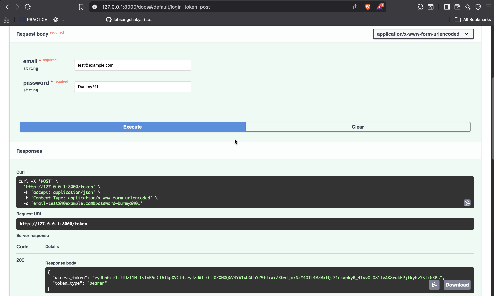
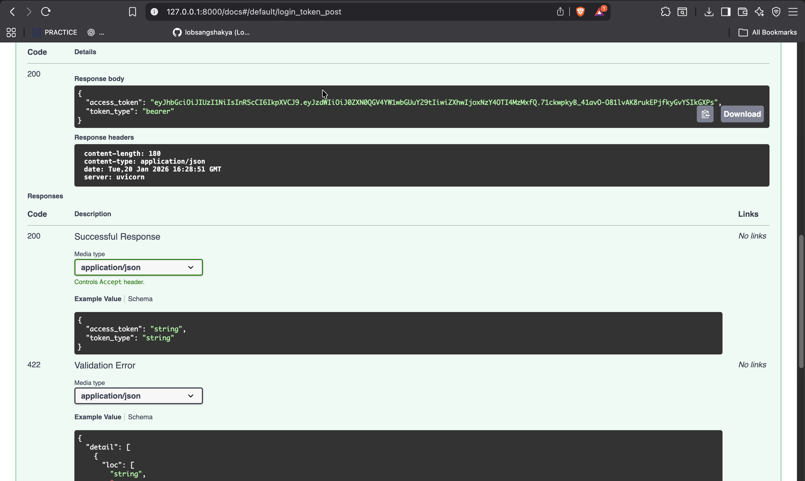

# JWT Auth API with FastAPI

A simple backend to:

- Create users with dummy credentials  
- Login and get a JWT (Header.Payload.Signature)  
- Protect routes using Dependency Injection  
- Verify tokens to allow access to protected endpoints

## Results

### Request

### Response

